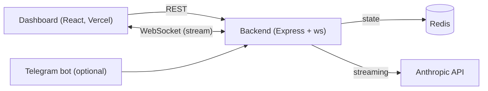

# Agent Dashboard

Multi-agent orchestrator for Claude. Spawn parallel agents with role-specific templates, monitor their execution in real time, and track per-agent token usage and cost.

Running an LLM agent is easy. Running several at once, each with a distinct role, and seeing what they cost while they stream, is the part that looks like production. This project does that: a single backend orchestrates many Claude agents over one server, streams every token to a live dashboard over WebSocket, and records token usage and dollar cost per agent so spend is never a surprise. Agents can be driven from the web UI or a Telegram bot.

- Parallel agents: many agents run concurrently, each an independent Claude conversation
- Real-time streaming: output appears token by token over a single WebSocket
- Role templates: general, code reviewer, and doc writer system prompts
- Cost tracking: input/output tokens and USD cost per agent, aggregated globally

[Live demo](#) · [Loom walkthrough](#)

## Architecture



One HTTP server serves both the Express REST routes and the WebSocket server on a single port. Redis is the only state store. A decoupled broadcast module lets the agent manager push WebSocket updates without importing the WebSocket server. Agent execution uses the Anthropic streaming SDK.

## Tech stack

Node.js, TypeScript, Express, ws, ioredis, Redis, grammy (Telegram), @anthropic-ai/sdk, React 18, Vite, zustand, Tailwind v4, express-rate-limit.

## Quickstart

Prerequisites: Node 20+, a running Redis, an Anthropic API key.

Backend:

```bash
cd backend
cp .env.example .env   # set ANTHROPIC_API_KEY, REDIS_URL, etc.
npm install
npm run dev            # http://localhost:3001
```

Dashboard:

```bash
cd dashboard
cp .env.example .env   # VITE_API_URL, VITE_WS_URL (defaults to localhost:3001)
npm install
npm run dev
```

Redis via Docker (backend + Redis only):

```bash
docker compose up
```

Telegram is optional. Without `TELEGRAM_BOT_TOKEN` the bot stays disabled and everything else works. With it: `/create <name> [template]`, `/mission <id> <task>`, `/list`, `/delete <id>`.

## Environment

Backend (`backend/.env`):

- `ANTHROPIC_API_KEY`, required
- `REDIS_URL`, default `redis://localhost:6379`
- `PORT`, default `3001`
- `DASHBOARD_ORIGIN`, CORS allow-origin, `*` if unset
- `TELEGRAM_BOT_TOKEN`, optional
- `ANTHROPIC_MODEL`, optional, defaults to `claude-sonnet-4-5`
- `DAILY_TOKEN_CAP`, default `200000`, public-demo spend guard

Dashboard (`dashboard/.env`): `VITE_API_URL`, `VITE_WS_URL`.

## Deployment

The dashboard targets Vercel (`dashboard/vercel.json`, SPA rewrite). The backend cannot run on Vercel because serverless has no persistent WebSocket, host it on Railway or Render, both support WebSockets and Redis.

- Railway (backend): set `ANTHROPIC_API_KEY`, `REDIS_URL`, `DASHBOARD_ORIGIN`, optional `TELEGRAM_BOT_TOKEN`, `ANTHROPIC_MODEL`, `DAILY_TOKEN_CAP`. The app trusts one proxy hop for correct client IP.
- Vercel (dashboard): set `VITE_API_URL` and `VITE_WS_URL` to the deployed backend (use `wss://` for the WebSocket URL).

## Future work

- Authentication and login
- Multi-user workspaces with per-user agent isolation
- Persistent conversation history beyond Redis (durable store, search)
- Streaming tool use and attachments, not just text
